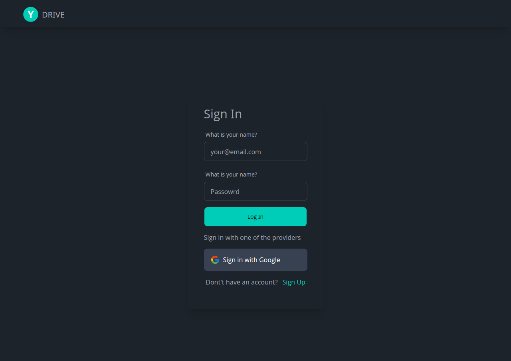
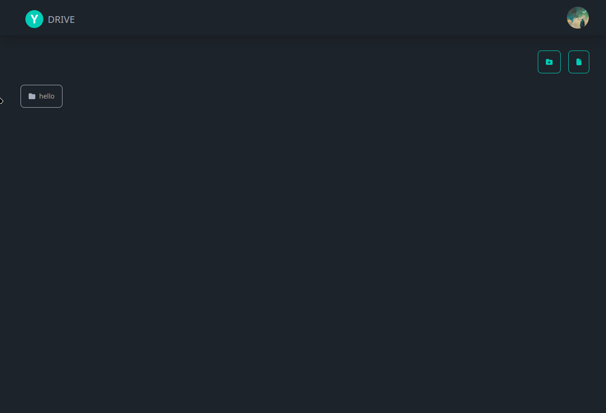

# YDrive

a could storage app based on firebase built on top of React.js, Tailwindcss and DaisyUI.

### Setup

- clone the repo and `cd` into it.

- install deps
  
  ```
  yarn install
  ```

- setup firebase
  
  - setup a new project in firebase and fill in your credentials in `firebase.js` file

- launch !
  
  ```
  yarn dev
  ```

### login page



### Adding New Folder



### Adding new File

> Note: if the same file added, it will update the current file,

the direct link to the uploaded file is attached to the button


